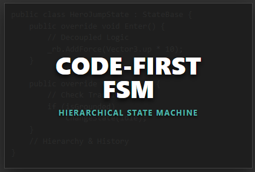

### 🧠 Code-First FSM
**The Hierarchical State Machine for Clean Architecture.**

Stop writing boolean flags in your `Update()` loop. This strictly typed framework lets you build complex AI and character logic using nested states, event triggers, and declarative transitions.



#### Key Features
* ✅ **Hierarchical (HFSM):** Nest states inside states (e.g., `Grounded` > `Walk`).
* ✅ **Visual Debugger:** View active states and history in real-time.
* ✅ **Zero Boilerplate:** Use lambda-based `ActionState` for rapid prototyping.

#### Code Preview
```csharp
// Define logic in pure C# classes (No MonoBehaviours)
var jumpState = new HeroJumpState(_blackboard);

// Declarative Transitions: "Jump when Space is pressed"
groundMachine.AddTransition(jumpState, () => Input.GetKeyDown(KeyCode.Space));

// Event Triggers: "Fire jump logic from anywhere"
_fsm.Trigger("Jump");

```

---


## 📧 Contact & Support

For bug reports, feature requests, or documentation questions:

**Email:** [alkiren44@gmail.com](mailto:alkiren44@gmail.com)
