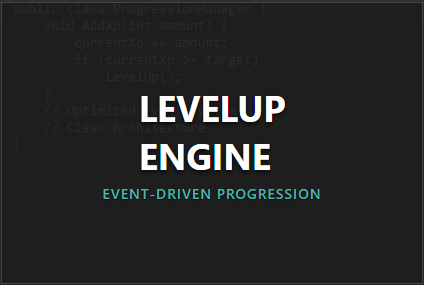
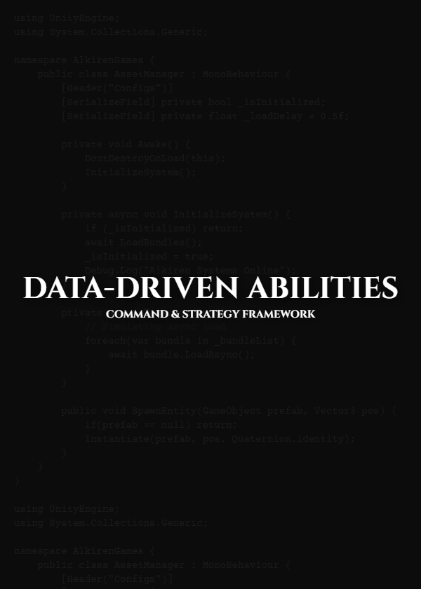

# Professional Architecture Tools
We build robust, event-driven systems to eliminate spaghetti code. Our assets follow strict industry standards (**SOLID**, **Strategy Pattern**, **Observer Pattern**) for serious engineers.

---

## 🛠️ Products

| Product | Description |
| :--- | :--- |
|  | **[Code-First FSM](Code_First_FSM/README.md)** A strict Hierarchical State Machine (HFSM) for building complex AI and character logic without boolean flags.  👉 [View Documentation](Code_First_FSM/README.md) |
|  | **[LevelUp Engine](LevelUp/README.md)** An event-driven progression system that decouples UI from math. Swap leveling strategies instantly.  👉 [View Documentation](LevelUp/README.md) |
|  | **[Data-Driven Abilities](Ability_System/README.md)** A professional Command & Strategy framework for RPG combat. Create spells and status effects without writing code.  👉 [View Documentation](Ability_System/README.md) |

---

## 📧 Contact & Support

For bug reports, feature requests, or documentation questions:

**Email:** [alkiren44@gmail.com](mailto:alkiren44@gmail.com)