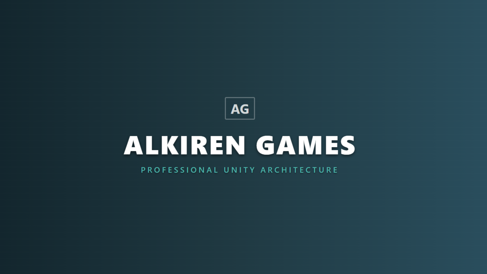

# Professional Architecture Tools
We build robust, event-driven systems to eliminate spaghetti code. Our assets follow strict industry standards (**SOLID**, **Strategy Pattern**, **Observer Pattern**) for serious engineers.

---

## 🛠️ Products

### 🚀 LevelUp Engine
**The Event-Driven Progression System for Unity.**

Stop putting leveling logic inside your `Update()` loop. The LevelUp Engine provides a clean, decoupled architecture to manage experience, levels, and stat curves.


#### Key Features
* ✅ **Strategy Pattern:** Swap leveling math (Linear, Exponential, MMO) instantly via Inspector.
* ✅ **Event-Driven:** UI updates automatically without polling.
* ✅ **Scalable:** Built for projects that plan to grow.

#### Code Preview
```csharp
// Clean, readable API designed for Senior Engineers
public void AddExperience(int amount)
{
    _currentXp += amount;
    
    // UI updates automatically via Events
    OnExperienceChanged?.Invoke(_currentXp);
    
    CheckLevelUp();
}

```

---

## 📧 Contact & Support

For bug reports, feature requests, or documentation questions:

**Email:** [alkiren44@gmail.com](mailto:alkiren44@gmail.com)

[View Project on GitHub](https://www.google.com/search?q=https://github.com/jarkof/Alkiren-Games)
